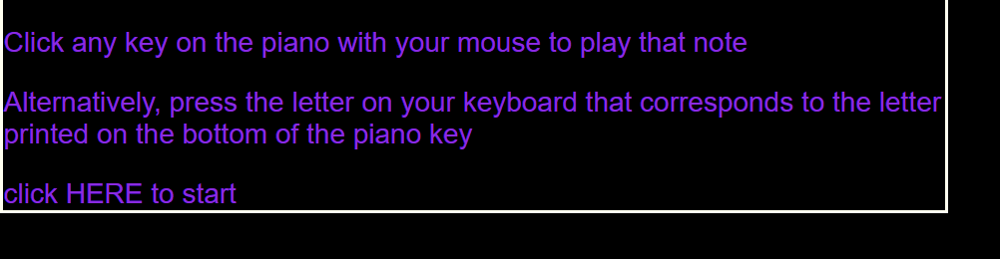
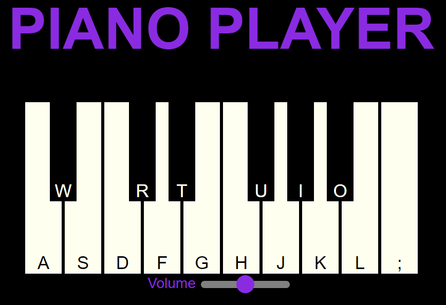
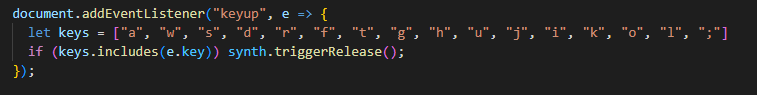

## Description

Piano Player is a web hosted musical keyboard where users can play fun snippets of simple notes and songs. 

Try it live here! https://smackey15.github.io/piano_player/

## Features

With Piano Player users can:

- Produce notes of sound by either clicking a piano key with their mouse, or by pressing a key on the computer keyboard associated with a piano key.
- Play both white and black keys comprising approximately 1.5 octaves from a standard piano.
- Increase/decrease the volume.
- See a visual highlighting effect when each note is played.

## Welcome Message

- Instructions appear by default in a modal when the page is loaded.
- Users click to close the modal and continue to the piano.

 

## Piano

- Keys are lettered to intuitively suggest the layout of a real piano (ie "W" is slightly above and between "A" and "S", as a black key would be in relation to two white keys)
- Users can hold down any note as long as they like without any disruption or distortion of sound.

 

## Coding Challenges

- PROBLEM: If a user is playing notes with their keyboard and holds down one note for a sustained period of time, the default output is an unpleasant machine-gun like effect where the note is played rapidly.  It is essentially repeating the initiation of the note over and over.  SOLUTION: By calling #repeat on the keyboard event (in this case keydown), a boolean is returned that indicates whether the key is being held down.  If true, we can return out of the function to avoid the unpleasant repitition!

- PROBLEM: In this app there can be a tendency towards repitition because one things happens (ie keyup/keydown) and the resulting action has to be applied to every possible note on the piano.  SOLUTION: The keyup function tells the synth object to release/stop making sound when a user has lifted their finger from the key.  Instead of writing "if key "x", then release" for every possible note, I created an array of all possible keys that could be pressed.  Then I said if the key associated with the keyup event is included in that array, then release.  This turned 16 lines of code into two lines!  

     

## Technologies, Libraries, APIs

- Tones.js library is used to handle the creation of sounds.
- HTML to create the piano framework.
- CSS to render the piano on the browser.
- Javscript to provide logic for playing the correct sound when each note is pressed. 
- Webpack to bundle the files. 

## Future Implementations

- Users able to change the type of sound output (ie synth, chime, etc.).
- Users able to record and play back snippets of notes.
