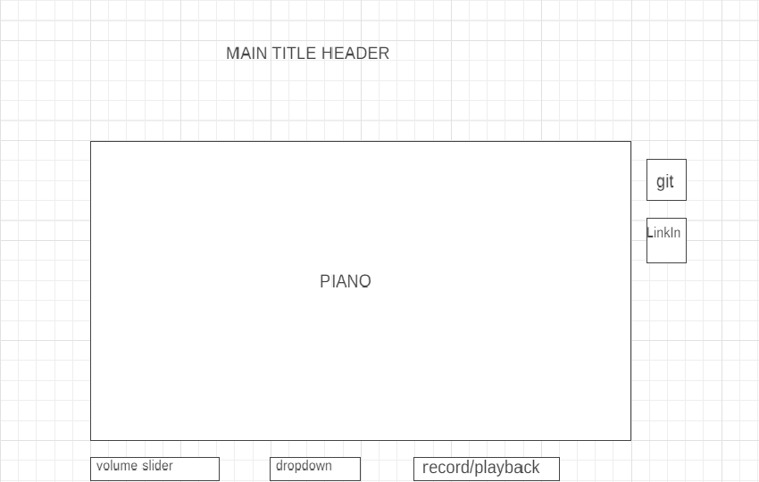

## Background

Piano Player is a web hosted musical keyboard.  The keys are styled to resemble keys on a real piano in order to evoke the feeling of playing a real piano. 

## Functionality & MVPs

In Piano Player, users will be able to:

- Produce notes of sound by either clicking a key with their mouse, or by pressing a key on the computer keyboard associated with a piano key.
- Play both white and black keys comprising approximately 1.5 octaves from a standard piano.
- Increase/decrease/mute the volume.

In addition, this project will include:

- README and instructions
- Optionally:
    - *A visual animation effect when each note is played*
    - *User able to change the type of sound output (ie synth, chime, etc.)*
    - *User able to record and play back snippets of notes*

## Wireframes

## Technologies, Libraries, APIs

- Web Audio API is used to handle the creation of sounds, specifically the Tones.js library.
- The piano will be rendered visually with CSS, Canvas, or by importing photos of real piano keys.  I like the latter because I want the keys to look real, but like the former two because they provide a chance to be more flexible and utilize another technology that I code.  Final decision TBD.
- Javscript, HTML, and Webpack

## Implementation Timeline

### Friday Afternoon
- Continue research, reading, and tutorials on the Tone.js library.
- Download Tone.js library and explore some of its features.
- Set up the project skeleton with a file tree in the Webpack format.

### Weekend
- Create an HTML doc with the basic structure of the piano keyboard.
- Style basic CSS so some version of the "keys" can be seen and played with during dev.
- Draft JS file with Event Listeners for keydown/mousedown and keyup/mouseup events.

### Monday
- Figure out how to add volume/mute button
- Assess timeline and progress to see if it's feasible to add options for user to select different sounds.
- Make decision about how keys will be styled and start on that.

### Tuesday
- Assess timeline and progress to see if it's feasible to add options for user to record and playback sounds.
- Continue styling keyboard and explore how the visual background (not the piano) will look.

### Wednesday
- Assess timeline and progress to see if it's feasible to add a visual/animation effect when a key is played.
- Continue testing and debugging the basic functionality of the user being able to create notes with the piano.
- Continue styling keys.

### Thursday Morning
- Flex/TBD